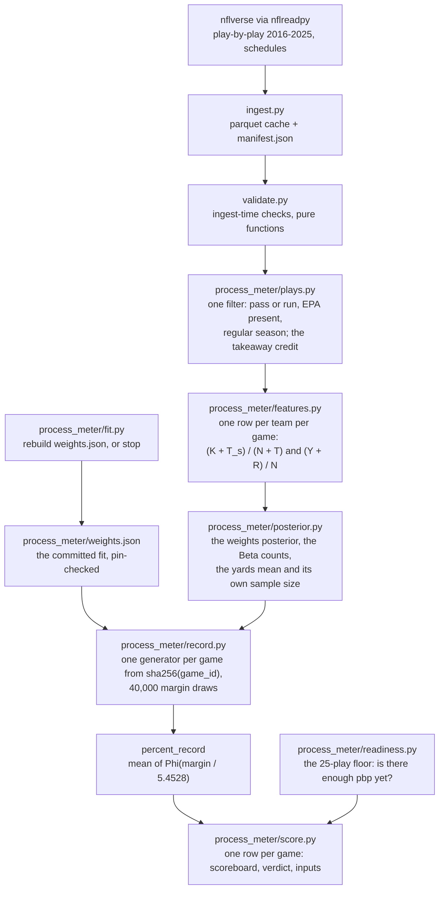

# nfl_simulator

**One deserve-to-win number per NFL game, from the plays each team ran** — a
retrospective verdict on a game that has already finished.

All data comes from the [nflverse](https://github.com/nflverse) project via
[`nflreadpy`](https://github.com/nflverse/nflreadpy) — full credit below in
[Data and credit](#data-and-credit).

## The idea

Given the plays each team ran in one game, how many points does play like that
usually score, and how often does the home side's play win?

Each team gets two numbers from its own plays:

- **its success rate** — the share of its plays that gained expected points
  (nflverse's `success` flag: a play whose expected points added is above zero);
- **its yards per play**.

A takeaway — an interception or a lost fumble — is folded into both, and folded
differently. It counts as **one more play** for the team that took the ball in
the success rate, successful when the offense lost expected points on it. Its
return yards are credited in yards per play, but it is **not** a play in that
denominator: a team is not charged a play in its yards per play for intercepting
the ball.

Weights fit on 2016–2023 turn the two into likely points. The difference between
the two teams' likely points is the deserved margin, and the meter is the share
of 40,000 draws of that margin that sit above zero. The gap between the actual
margin and the deserved one is what this project calls luck.

## One example

Cincinnati at Cleveland, week 1 of 2025. The scoreboard read **CIN 17–16**; the
process read **74.9% Cleveland**.

| | plays | yards | success rate | yards per play | likely points |
|---|---|---|---|---|---|
| CLE (home) | 71 | 327 | 0.394 | 4.61 | 16.3 |
| CIN (away) | 49 | 141 | 0.431 | 3.06 | 11.1 |

Cincinnati's rate is the higher of the two, and it is higher *because of the
fold*: the Bengals took the ball away twice, so their rate is 22 successes over
51 — 49 own plays plus the two takeaways — while their yards per play still
divides by the 49. Cleveland ran 22 more plays for 186 more yards, and that is
where the 5.2-point deserved margin comes from.

```python
from nfl_simulator.process_meter import load_weights, score_games

table = score_games(2025, ["2025_01_CIN_CLE"], load_weights())
print(table[["home", "away", "home_score", "away_score", "p_home"]])
```

**How to read it.** `p_home` is the home team's share. A number near 50 means the
game was genuinely close on the merits, however the scoreboard read; a number far
from 50 on the side of the team that *lost* means the scoreboard and the process
disagree, which is what happened here. The per-side inputs are on the same row,
so a verdict can always be traced back to the four numbers that produced it.

## Method, in brief

Three closed-form draws, and nothing else. Writing K for a team's own successes,
N for its own plays, T for its takeaways (T_s of them successful for the taker),
Y for its own yards and R for its credited return yards:

    weights ~ Normal(the 2016-2023 least-squares fit, its covariance)
    rate    ~ Beta(K + T_s + 1, N - K + T - T_s + 1)         narrows by N + T
    yards   ~ Normal((Y + R) / N, y_sd / sqrt(N))            narrows by N

    margin draw = b_rate (rate_home - rate_away) + b_ypp (yards_home - yards_away)
    p_home      = the mean over 40,000 draws of Phi(margin draw / 5.4528)

`Phi` is the standard Normal curve. Every posterior is closed form, so there is
no sampler to diagnose. Two things make the number reproducible: each game gets
its **own generator**, seeded from a hash of its game id, so a game scored alone
reads exactly what it reads inside a week's batch; and the draw count is 40,000,
the smallest count that met a pre-registered stability rule.

The scale 5.4528 is not the fit's residual standard deviation. That number was
fit to realised rates, so it already contains their sampling noise, which the
draws above add a second time; the scale of record takes it back out. The
derivation, and the convention behind the last decimal, are in
[76 — The sampler of record](docs/research/76-sampler-of-record.md).

The weights ship as a committed 1 KB artifact. The library **never refits at
score time**, and a pin refuses any artifact whose weights or constants are not
the ones that passed the gate.

## What the meter includes

Every game gets one verdict, and it reads the same things in every season from
2016 on — there is no charting dependency and so no coverage that changes with
the calendar.

| What counts | How |
|---|---|
| pass and run plays with EPA | the success rate's numerator and denominator, and the yards |
| sacks | a pass play with negative yards, like any other |
| scrambles | a run |
| interceptions and lost fumbles | one more play for the taking team in the success rate; their return yards credited in its yards per play |
| garbage time | kept; no win-probability filter |

| What does not | Why |
|---|---|
| two-point tries | they carry no EPA the model can read |
| postseason | the fit and the gate are regular-season |
| everything below | out by decision, see the next section |

## What is deliberately out

Each of these was considered and left out, and none is queued:

- **Special teams** — field goals, punts, kickoffs and every return other than a
  takeaway's. Nothing in the model sees them.
- **Field position** — two teams with the same success rate and the same yards
  per play get the same likely points wherever their drives started.
- **Penalties** — a play wiped out by a flag is not in the frame at all.
- **Charting data** — no dropped-interception or receiver-drop inputs, and no
  paid feed of any kind. The model reads nflverse play-by-play and nothing else.
- **Opponent adjustment** — measured, and it turned out to be shrinkage toward
  the league mean rather than information about the opponent.

This is also not a replay engine and not a ranking. Nothing here re-runs a game
play by play, models play calling, drive continuation or clock management, or
claims which of two teams is better. A deserve-to-win number is a retrospective
statement about *one game*, and stripping luck was tested and found not to
improve forward-looking prediction. See
[75 §2 and §7](docs/research/75-process-meter-foundations.md).

## Install and quickstart

```bash
uv sync --extra dev
uv run pytest -m "not slow"
uv run ruff check .
```

`uv sync` builds the environment from `uv.lock`, so a fresh clone runs the exact
dependency versions the shipped numbers were validated against.

Pull the data once — ten seasons of play-by-play, cached to a **gitignored**
`data/` directory alongside a manifest recording seasons, pull date and library
version:

```bash
uv run python -m nfl_simulator.ingest
```

Then score a game:

```python
from nfl_simulator.process_meter import load_weights, build_frames, score_games

weights = load_weights()  # the committed artifact, pin-checked
frames = build_frames(2025)  # the frame and its posterior, once
scored = score_games(2025, ["2025_01_CIN_CLE"], weights, frames=frames)

round(float(scored.p_home.iloc[0]), 4)  # 0.7488
```

Building the frames reads every cached season and is the expensive part, so score
a whole week in one call, or build once and pass `frames=` to each call. A scored
row carries the scoreboard, both sides' likely points, the model's two inputs per
side and the five numbers the draws read.

`NFL_SIM_DATA_DIR` points the loaders at a cache outside the checkout; absent, it
is the repo's own `data/`.

**Re-fitting the weights** is a deliberate act, not part of a run:

```bash
uv run python -m nfl_simulator.process_meter.fit --data-dir data --out /tmp/w.json
```

It re-measures the weights, the training row count, the residual scale and
`sigma_once`, prints both readings of the scale, and **refuses to write** if any
pinned number has moved.

## The pipeline



`style.py` and `teams.py` are the figure layer — palette, title blocks, club
marks and colour pairing — and no scoring path imports them. `paths.py` is
filesystem layout rather than a pipeline stage.

## Layout

| Path | What's in it |
|---|---|
| `src/nfl_simulator/process_meter/` | The model: loaders, features, posteriors, draws, weights, scorer |
| `src/nfl_simulator/` | Ingest, validation, filesystem layout, and the figure layer (`style`, `teams`) |
| `research/` | Exploratory and build scripts from the previous model's research |
| `docs/research/` | The numbered record: pre-registrations, results, ship notes |
| `docs/writeup/figures/` | Rendered figures and their caption sheet |
| `tests/` | pytest suite; everything but `-m slow` is network- and cache-free |
| `data/` | Gitignored parquet cache + manifest |

## The research record

[`docs/research/`](docs/research/) holds seventy-odd numbered documents. They
exist because of one rule: **every gate is written down before the model that has
to pass it is fit**, so a document is a decision record, not a write-up of
results that already happened. Several of them report failures for that reason.

A reader who wants the argument rather than the archive should start with these:

| Doc | What's in it |
|---|---|
| [75 — The process meter: foundations](docs/research/75-process-meter-foundations.md) | The model of record: its two inputs, the takeaway fold, every constant |
| [76 — The sampler of record](docs/research/76-sampler-of-record.md) | Why the number is a draw average, and the gate behind the seed, the draw count and the scale |
| [05 — Neutralization principle](docs/research/05-neutralization-principle.md) | The one rule, the two gates, and the per-component treatment table |
| [05b — FG model foundations](docs/research/05b-fg-model-foundations.md) | The kicker-hierarchical make model and its pre-registered gates |
| [09 — Coin-flip candidates](docs/research/09-coinflip-candidates.md) | Every candidate component, and why most were refused |
| [33 — Magnitude audit](docs/research/33-magnitude-audit.md) | Does a small luck share ever actually change a verdict? |
| [59 — The two editions](docs/research/59-a3-enacted.md) | the second coverage level, enacted |
| [68 — Simulator v1.4](docs/research/68-simulator-v14.md) | The previous model's last release, its gates, and what moved |

Documents 00–74 are the previous model's record and are left exactly as they were
written. They are a decision record, and a decision record that gets edited after
the fact is worth nothing.

## Reading a post

The account that publishes these verdicts shows a **whole percent**, and calls a
team that won the game with a share of 47 or less a *luck merchant*. That is the
poster's display rule and it lives with the poster: there is no such line in this
library, and nothing here rounds or flags anything.

## The process rules

Four rules bind every round, each added after a failure that would have been
avoided by it:

1. **Pre-register before fitting** — the gate document lands in git before the
   script that fits its models.
2. **Power-check every threshold before committing to it** — a threshold with no
   power calculation behind it is a coin flip about your own result.
3. **Mechanism before arithmetic** — no statistic can detect the *absence* of a
   branch point, so the mechanism gate runs first and can disqualify a component
   before a model is fit.
4. **Characterize an instrument before writing its gate** — measure what a test
   can actually see before trusting what it says.

## Status

**Shipped: process meter v2.1.0** (2026-09-23) — the model described above, with
its weights, its fit and its stage-0 checks. The previous model is retired; see
below.

The version number tracks the model label rather than the package's own history.
Version 2.0 was a two-week interim definition that counted a takeaway as a play
in *both* inputs; it was never released as a library, so `v2.0.0` was never cut.

The write-up of the previous model's method for a general reader is
[Who Deserved to Win? Pricing Luck in NFL Games](https://medium.com/@dmgrifka_64770/who-deserved-to-win-pricing-luck-in-nfl-games-02d5ae4ced91)
— every figure in it lives in this repository, and it describes v1, not the
model above.

## The previous model (v1, 2026-08-31 to 2026-09-16)

Version 1 answered the same question a different way. Instead of asking what a
team's play usually scores, it re-adjudicated the game event by event: for each
play whose outcome contained a coin flip — a fumble on the ground, a field-goal
attempt, an extra point, a dropped interception, a receiver drop — it replaced
the realized Expected Points Added with its expectation, then bootstrapped those
coin flips into a distribution over margins.

It is retired, and **its code is not in this repository any more**. The last
release is tagged:

- **the code** — [v1.4.3](https://github.com/dgrifka/nfl_simulator/tree/v1.4.3)
- **the record** — documents [00–74](docs/research/) here, unchanged
- **the wiki** — the pages grouped under *v1 (retired 2026-09-17)* in the
  [Wiki](../../wiki)
- **the research scripts** — `research/` here, which run at tag v1.4.3

**v1 read FTN charting.** Its dropped-interception and receiver-drop components
needed FTN Data's `is_interception_worthy` and `is_catchable_ball` fields, which
begin in 2022, so its coverage depended on the season: fumbles, field goals and
extra points from 2016, plus the two charting components from 2022. The process
meter reads no charting at all, which is why its coverage does not.

**Credit for that charting.** The dropped-pass and interceptable-throw fields
behind v1's dropped-pick and receiver-drop components are
[FTN Data](https://ftndata.com)'s, delivered through nflverse. Figures whose
verdict read them are stamped `Data: nflverse & FTN` for that reason — the credit
names the sources that verdict actually used.

## Wiki

Explanatory pages — one idea at a time, rewritten for a reader who wants the
explanation rather than the dated record — live in this repo's
[Wiki](../../wiki). The numbered documents stay here as the record.

## Data and credit

Everything comes free via [`nflreadpy`](https://github.com/nflverse/nflreadpy):
play-by-play 2016–2025 and schedules.

**Credit.** The play-by-play, schedules, team colours and club marks all come
from the [nflverse](https://github.com/nflverse) project — `nflreadpy` on top of
the `nflfastR` play-by-play data — whose licence asks that its data be credited
wherever it is used. Every figure this repo renders carries `Data: nflverse` in
its watermark for that reason. Club logos are the clubs' own marks, cached under
the gitignored `data/` directory for rendering and never redistributed here.

## Licence

- **Code** — MIT, see [`LICENSE`](LICENSE).
- **Documentation and figures** (`docs/`) — Creative Commons Attribution 4.0
  International, see [`LICENSE-docs`](LICENSE-docs).

Club marks are the clubs' own and are covered by neither: they are cached under
the gitignored `data/` directory and never redistributed here.
