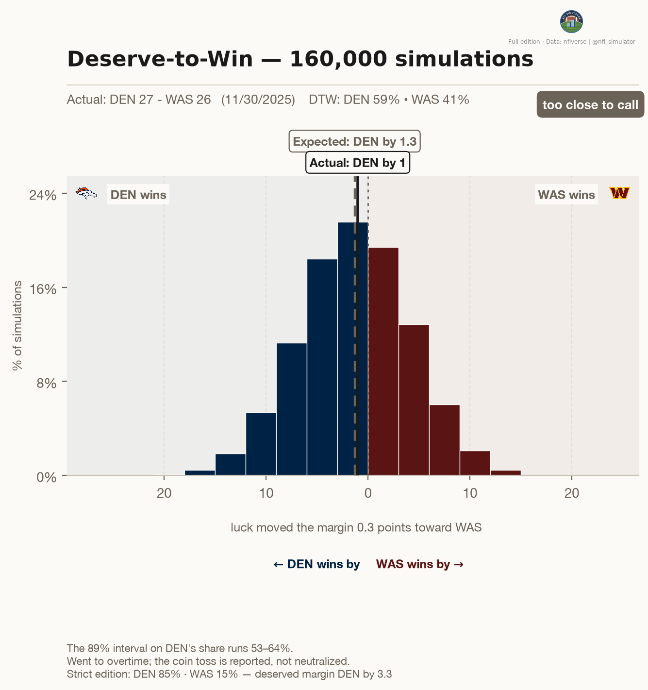
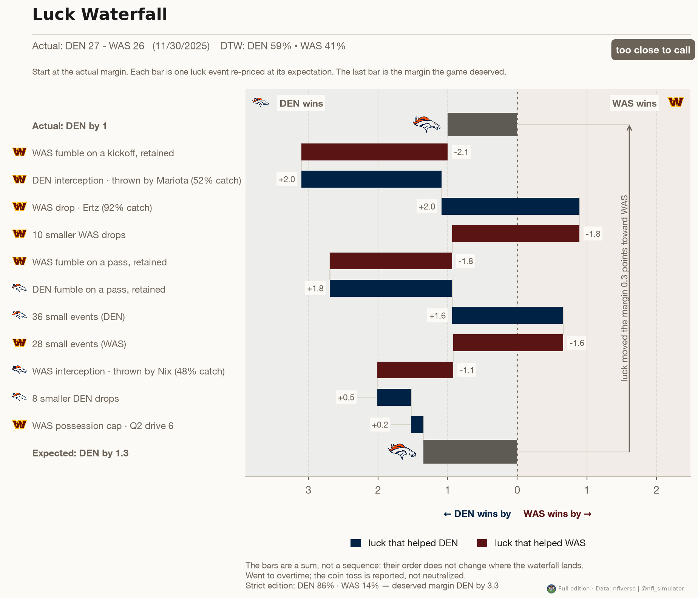
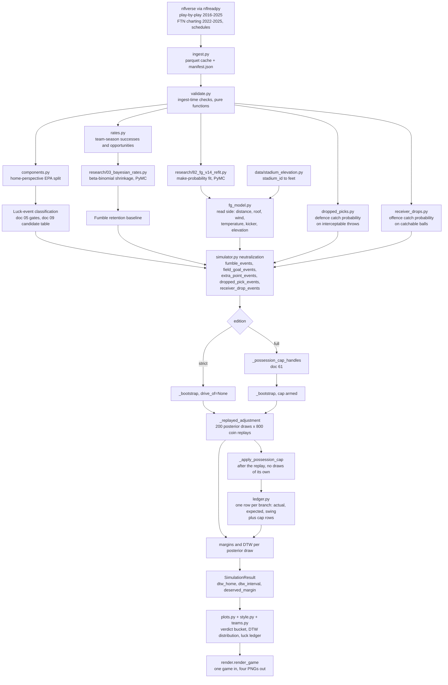

# nfl_simulator

**Re-adjudicate one NFL game by neutralizing luck, not by replaying plays** — a
*deserve-to-win* simulator for a single game that already happened.

All data comes from the [nflverse](https://github.com/nflverse) project via
[`nflreadpy`](https://github.com/nflverse/nflreadpy) — full credit below in
[Data and credit](#data-and-credit).

## The idea

Most single-game outcomes mix two things: what a team *did* (skill, and the
choices that flow from it) and what *happened to them* (which way a loose ball
bounced, whether a 48-yard field goal drifted inside the upright). This repo
tries to separate them.

The approach is **luck-neutralized EPA accounting**, not play-splicing replay.
For each play whose outcome contains a coin flip, we replace the realized
Expected Points Added with its expectation:

- a fumble on the ground becomes the average of the recovered/not-recovered
  branches rather than the branch that actually happened,
- a field-goal attempt becomes make-probability-weighted points rather than
  3 or 0,
- and so on for the other components the research classifies as luck.

Re-bootstrapping those coin flips many times gives a distribution over margins —
a "deserve-to-win" probability for the game that actually got played.

## One example

Denver at Washington, week 13 of 2025.



**How to read it.** The histogram is the deserved margin across every
re-simulation of the game's luck events; the deserve-to-win percentage is the
share of that mass on one side of zero. The actual margin is marked separately —
where it sits relative to the mass is the whole claim. A distribution straddling
zero means the game was genuinely close on the merits, however the scoreboard
read.



The ledger is the audit trail: one row per luck event, each showing what
happened, what was expected, and the difference in points. The rows sum to the
gap between the actual margin and the deserved one — nothing is neutralized
without appearing here.

## Method, in brief

**One rule governs every component.** Luck is the realized outcome minus its
expectation at the responsible entity's *shrunk* rate. Full and partial
neutralization are not two policies — they are the same expression read at two
values of `w = n/(n+κ)`, and `w` is measured from the data, never chosen. A
component must first pass a mechanism gate: if there is no branch point, no
statistic can neutralize it. See
[05 — the neutralization principle](docs/research/05-neutralization-principle.md)
and [09 — the coin-flip candidates](docs/research/09-coinflip-candidates.md) for
what was admitted and what was refused.

**Then a two-layer bootstrap.** The outer layer draws from the posterior over
the rates themselves (how often a team recovers its own fumble, how often a
kicker makes a 45-yarder in these conditions); the inner layer re-flips every
coin in the game at the drawn rates. The result is a distribution over deserved
margins, and the deserve-to-win probability is the share of it on one side of
zero — so the number carries both kinds of uncertainty, not just the coins.

## What the meter includes

Every game gets **one** deserve-to-win verdict. Which luck components feed it
depends on the season, because the data does:

| Seasons | In the ledger |
|---|---|
| 2016–2025 | fumbles, field goals, extra points |
| 2022–2025 | the above **plus** dropped interceptions and receiver drops |

The two extra components need FTN charting's `is_interception_worthy` and
`is_catchable_ball` fields, which begin in 2022 — earlier seasons simply have
no charting to read. Where they are included, a **possession cap** applies:
two luck events on the same drive are not independent, so a possession books
at most its largest single swing rather than the sum. Internally — filenames
and the API's `edition` field — the two coverage levels are labeled `strict`
and `full`. See [59 — the two editions](docs/research/59-a3-enacted.md) and
[62 — the possession cap](docs/research/62-possession-cap.md).

Across the 1,139 games of 2022–2025, the deserved winner differs from the
scoreboard in **168 of them (14.75%)** — about one game in seven
([68 §6](docs/research/68-simulator-v14.md)). Verdicts ship in three buckets
rather than one cutoff: **127 clear flips, 97 too close to call** (deserved-win
probability between 40 and 60%) and **915 where the scoreboard holds** — and
309 games (27%) are pinned at 0 or 100, decided beyond luck's reach
([64 §12](docs/research/64-one-simulator-summary.md)).

## What is deliberately out of scope

This is not a replay engine and it is not a ranking. Nothing here re-runs a game
play by play, models play calling, drive continuation or clock management, or
claims which of two teams is better — a deserve-to-win figure is a retrospective
statement about *one game's* luck, and luck-stripping was tested and found not to
improve forward-looking prediction. Neither does the simulator neutralize
everything it can see: components that pass the mechanism gate but fall under a
pre-registered materiality floor are reported and left alone.

## Install and quickstart

```bash
uv venv
uv pip install -e '.[dev]'
uv run pytest
uv run ruff check .
```

Pull the data, build the artifacts, then render a game:

```bash
uv run python -m nfl_simulator.ingest      # ten seasons of play-by-play; cached
uv run python research/26_overtime.py      # the overtime-toss sidebar artifact
uv run python research/82_fg_v14_refit.py  # the make-probability posterior
uv run python research/83_simulator_v14.py # adjudications, 2016–2025
uv run python research/84_full_edition_v14.py  # adds the charted components, 2022–2025
```

```python
from nfl_simulator.render import render_game

render_game("2025_13_DEN_WAS")  # four PNGs into research/outputs/
```

The first ingest downloads ten seasons and caches them to a **gitignored**
`data/` directory alongside a manifest recording seasons, pull date and library
version; re-running it is a no-op, and `--force` re-downloads. The three
research scripts fit posteriors and write to the gitignored `research/outputs/`,
so they take a while and only need running once per checkout.

### Adjudicating a game that has just gone final

`render_game` reads a game's numbers from the shipped 2016–2025 artifacts, so it
cannot be pointed at a game that has no row in them. `adjudicate_live_game` is
the other door: it pulls that game's play-by-play, adjudicates it with the same
fitted pieces, and writes the same four PNGs — without consulting the shipped
summary for the game it is deciding.

```python
from pathlib import Path

from nfl_simulator import adjudicate_live_game

result = adjudicate_live_game("2026_01_DAL_PHI", out_dir=Path("out"))

result.figures  # list[Path] — the four PNGs, in render.SUFFIXES order
result.edition  # "strict" or "full"; "strict" when FTN charting is missing
result.edition_note  # why, in one sentence, when the edition was reduced
result.dtw_home  # deserve-to-win share for the home team
result.dtw_low  # the 89% interval on it
result.dtw_high
result.deserved_margin  # home perspective, in points
result.actual_margin
result.home_team  # season-correct club codes
result.away_team
result.home_points  # the scoreboard, or None when the game is in no schedule
result.away_points
result.headline  # the biggest single luck event in words, or None
result.game_id
```

It needs two directories, and an installed package that has neither says which
one is missing:

| Variable | What goes in it | Default |
|---|---|---|
| `NFL_SIM_DATA_DIR` | the cached nflverse pulls — `pbp/`, `ftn/`, schedules, logos, manifest | the repo's `data/` |
| `NFL_SIM_ARTIFACT_DIR` | the fitted artifacts — posteriors, their summaries, the shipped parquets | the repo's `research/outputs/` |

The 2016–2025 play-by-play cache has to be present either way: the fumble,
field-goal and extra-point baselines are fit on that whole window, so a 2026
game still needs it. One game takes about 2.4 s once the baselines are fit
(~1.3 s, cached for the life of the process), and the call is deterministic —
same seed, same draw counts, same pixels.

## The pipeline



Two modules are deliberately absent from it: `placement.py`, a reported
diagnostic that never enters an adjudication, and `paths.py`, which is
filesystem layout rather than a pipeline stage.

## Layout

| Path | What's in it |
|---|---|
| `src/nfl_simulator/` | Importable package: ingest, validation, EPA decomposition, FG model, ledger, simulator, product layer |
| `research/` | Exploratory and build scripts — EDA, skill-vs-luck tests, Bayesian models, power calculations, validation |
| `docs/research/` | The numbered record: pre-registrations, results, ship notes |
| `docs/writeup/figures/` | Rendered figures and their caption sheet |
| `tests/` | pytest suite (network-free by default) |
| `data/` | Gitignored parquet cache + manifest |

## The research record

[`docs/research/`](docs/research/) holds seventy numbered documents. They exist
because of one rule: **every gate is written down before the model that has to
pass it is fit**, so a document is a decision record, not a write-up of results
that already happened. Several of them report failures for that reason.

A reader who wants the argument rather than the archive should start with these:

| Doc | What's in it |
|---|---|
| [05 — Neutralization principle](docs/research/05-neutralization-principle.md) | The one rule, the two gates, and the per-component treatment table |
| [05b — FG model foundations](docs/research/05b-fg-model-foundations.md) | The kicker-hierarchical make model and its pre-registered gates |
| [09 — Coin-flip candidates](docs/research/09-coinflip-candidates.md) | Every candidate component, and why most were refused |
| [33 — Magnitude audit](docs/research/33-magnitude-audit.md) | Does a small luck share ever actually change a verdict? |
| [59 — The two editions](docs/research/59-a3-enacted.md) | the second coverage level, enacted |
| [68 — Simulator v1.4](docs/research/68-simulator-v14.md) | The current release, its gates, and what moved |

## The process rules

Four rules bind every round, each added after a failure that would have been
avoided by it:

1. **Pre-register before fitting** — the gate document lands in git before the
   script that fits its models.
2. **Power-check every threshold before committing to it** — a threshold with no
   power calculation behind it is a coin flip about your own result.
3. **Mechanism before arithmetic** — no statistic can detect the *absence* of a
   branch point, so the mechanism gate runs first and can disqualify a component
   before a model is fit.
4. **Characterize an instrument before writing its gate** — measure what a test
   can actually see before trusting what it says.

## Status

**Shipped: simulator v1.4** (2026-08-31) — stadium elevation joins the
make-probability model, worth +4.09 percentage points of make probability on a 45-yard
kick in Denver. The ship record, with every gate and what moved, is
[68 — Simulator v1.4](docs/research/68-simulator-v14.md).

The measurement program is closed: every candidate component is shipped, refused
with the arithmetic attached, or marked unmeasurable. A longer write-up of the
whole method for a general reader is forthcoming.

## Wiki

Explanatory pages — one rule, one component, one figure at a time, rewritten for
a reader who wants the explanation rather than the dated record — live in this
repo's [Wiki](../../wiki). The numbered documents stay here as the record.

## Data and credit

Everything comes free via [`nflreadpy`](https://github.com/nflverse/nflreadpy):
play-by-play 2016–2025 and FTN charting 2022–2025.

**Credit.** The play-by-play, schedules, team colours and club marks all come
from the [nflverse](https://github.com/nflverse) project — `nflreadpy` on top of
the `nflfastR` play-by-play data — whose licence asks that its data be credited
wherever it is used. Every figure this repo renders carries `Data: nflverse` in
its watermark for that reason. Club logos are the clubs' own marks, cached under
the gitignored `data/` directory for rendering and never redistributed here.

## Licence

- **Code** — MIT, see [`LICENSE`](LICENSE).
- **Documentation and figures** (`docs/`) — Creative Commons Attribution 4.0
  International, see [`LICENSE-docs`](LICENSE-docs).

Club marks are the clubs' own and are covered by neither: they are cached under
the gitignored `data/` directory and never redistributed here.
